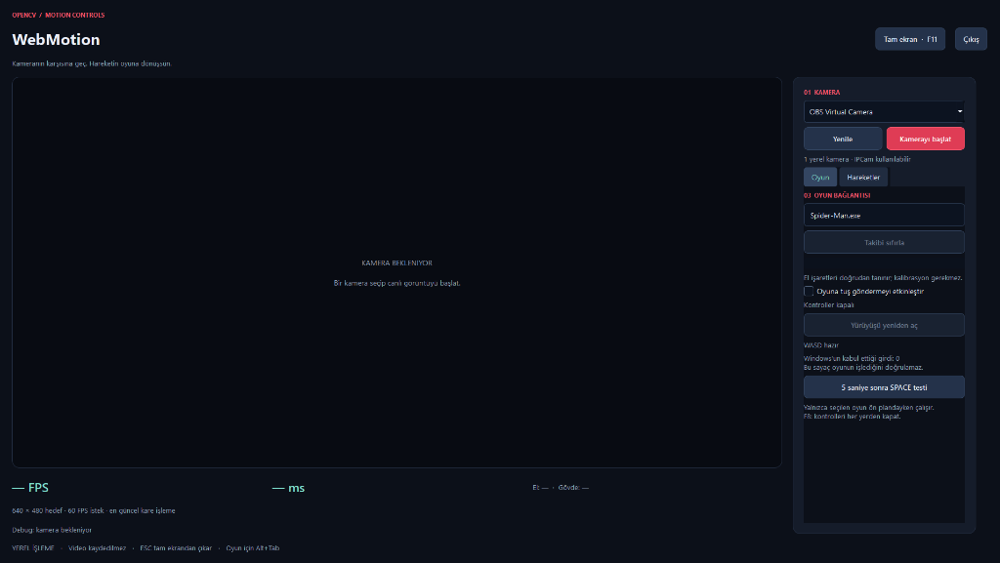

<div align="center">

# 🕸️ WebMotion — Motion & Gesture Controller

**Kameranın karşısına geç. Hareketin oyuna dönüşsün.**  
*Step in front of the camera. Turn your movements into gameplay.*

[](https://www.microsoft.com/windows)
[](https://www.python.org/)
[](https://opencv.org/)
[](https://developers.google.com/mediapipe)
[](https://www.qt.io/)
[](#development)

<br/>

[🇹🇷 **Türkçe Dokümantasyon**](#-türkçe-dokümantasyon) &nbsp; | &nbsp; [🇬🇧 **English Documentation**](#-english-documentation)

<br/>

---

### 🎮 Oynanış & Tanıtım Videosu / Gameplay Showcase

[](https://youtu.be/eirEkE7Fyvk)

> 👆 *Videoyu izlemek için görsele veya linke tıklayın / Click thumbnail or link to watch:*  
> 🔗 **YouTube:** [https://youtu.be/eirEkE7Fyvk](https://youtu.be/eirEkE7Fyvk)

---

### 🖥️ Uygulama Arayüzü / Console Interface

<p align="center">
  
</p>

---

</div>

<br/>

> [!NOTE]
> ### ⚠️ Proje Geliştirme & AI Notu / AI Attribution Note
> **TR:** Bu projenin çekirdek mimarisi, bilgisayarlı görü işlem hattı (OpenCV & MediaPipe entegrasyonu), hareket durum makineleri (gesture state machines), Windows API girdi tetikleyicileri ve tüm oyun kontrol algoritmaları **geliştirici tarafından tasarlanmış ve kodlanmıştır**. Yapay Zeka (AI) sadece dosya/klasör düzeni oluşturma ve raporlama/dokümantasyon süreçlerinde yardımcı bir asistan olarak kullanılmıştır. Proje hazır bir yapay zeka çıktısı değildir.
> 
> **EN:** The core architecture, computer vision pipelines (OpenCV & MediaPipe), gesture state machines, native Windows API input synthesis, and responsive control algorithms were **designed and developed directly by the author**. Artificial Intelligence (AI) was merely utilized as an assisting utility for directory restructuring, documentation formatting, and reporting. This project is **not** an AI-generated codebase.

<br/>

---

# 🇹🇷 Türkçe Dokümantasyon

## 📖 Genel Bakış

**WebMotion**, hiçbir harici donanıma, VR başlığına veya fiziksel oyun koluna gerek duymadan standart bir webcam veya ağ kamerası (IPCam) kullanarak vücut ve el hareketlerinizle **Marvel's Spider-Man Remastered** (ve genel PC oyunları) oynamanızı sağlayan düşük gecikmeli, masaüstü hareket kontrol yazılımıdır.

Kalibrasyon adımları, kutucuk çizme veya ekrandaki sanal alanlara bağlı kalma zorunluluğu yoktur. Kamera önünde elinizi kaldırdığınız an sanal joystick merkezi belirlenir, yön ve nişan hareketleri dinamik ivmelenme eğrileriyle farenin yerini alır.

---

## ✨ Öne Çıkan Özellikler

- **Kalibrasyonsuz & Özgür Kontroller:** Önceden duruş veya bölge kalibrasyonu gerektirmez. Kadrajın herhangi bir yerinde el işareti yaptığınız an kontrol başlar.
- **Sanal Joystick Kamera Sistemi:** İki parmak nişan ve tek parmak serbest bakış modlarında elinizin açıldığı nokta merkez (nötr) kabul edilir. Merkezden uzaklaştıkça kamera dönüş hızı ivmelenir; merkeze dönünce dönüş durur (kadraj dışına taşmadan sınırsız dönüş).
- **Akıllı Ağ Salınımı (Swing Handoff):** Ağ atma işareti (Spider-Man web gesture) ile kesintisiz salınım (`Space` → `Shift`). İki el arasında salınım devri (handoff) desteklenir; el değiştirirken `Shift` bırakılmaz, sarsıntı yaşanmaz. Salınım anında yumruk sıkılarak salınımdan zıplayarak çıkılır.
- **Ayrık Avuç İçi WASD Hareketi:** Diğer açık avuç içi bağımsız bir WASD joystick'i gibi çalışır. Ağ salınımına geçildiğinde yanlışlıkla yürüme kilitlenir; tek tuşla tekrar açılabilir.
- **Gelişmiş Dövüş & Vücut Hareketleri:**
  - **Hulk Clap (Ağ Bombası / F):** İki elin hızla birbirine yaklaşmasıyla tetiklenir.
  - **Nişan & Ağ Atıcı (E):** Nişan esnasında parmakları kapatıp açarak çift 'E' komutu gönderilir.
  - **Yumruk (Sol Fare Tuşu):** Hızlı ileri yumruk hareketiyle seri saldırı.
  - **Zıplama & Sıyrılma (Dodge / Ctrl):** Omuz ve gövdenin ani çöküşü ile sıyrılma, ani yükselişi ile zıplama.
- **IPCam & Ağ Kamerası Desteği:** USB web kamerası olmasa bile telefonunuzu HTTP/MJPEG/RTSP akışı ile doğrudan kablosuz kontrol kamerasına dönüştürebilirsiniz.
- **Çok İş Parçacıklı (Multi-threaded) & Düşük Gecikmeli Mimari:** Görüntü yakalama, yapay zeka çıkarımı (MediaPipe) ve Windows giriş işçisi (InputGuard) birbirinden bağımsız thread'lerde çalışır; oyun FPS'ini etkilemez.
- **Güvenlik & Pencere Kilidi:** Girdiler yalnızca `Spider-Man.exe` ön plandayken gönderilir. Alt+Tab yapıldığında veya kamera koptuğunda (watchdog) basılı tuşlar derhal serbest bırakılır. **F8** acil durum durdurma tuşudur.

---

## 🎮 Hareket & Tuş Eşleşmeleri Tablosu

| Hareket / Duruş | Oyun Girdisi | Detay ve Davranış |
| :--- | :---: | :--- |
| **Yukarı Kaldırılmış Ağ Hareketi** *(Baş, işaret ve serçe parmak açık)* | `Space` → `Shift` | Kesintisiz ağ salınımı başlatır. 350 ms el kaybı toleransı. |
| **Ağ Elini Sağa / Sola Kaydırma** | Yatay Kamera | Salınım yönünü tayin eder. Diğer el hareketleri kilitlenir. |
| **Salınım Elini Yumruk Yapma** | `Space` Pulse | Salınımı kesip ileriye doğru güçlü bir sıçrama yapar. |
| **İki Parmak Açık (İşaret + Orta)** | `Sağ Tık (RMB)` | Kadrajın her yerinde nişan moduna girer; elin başladığı yer merkezdir. |
| **Nişan Alırken Parmakları Kapatma** | `E` × 2 | Ağ bombası / alet fırlatma (iki ardışık bas-bırak darbesi). |
| **Nişan Elinin Avucunu Açma (250 ms)** | Nişandan Çıkış | Sağ tık bırakılır, normal görünüme dönülür. |
| **Yalnızca İşaret Parmağı Açık** | Serbest Kamera | Nişan almadan etrafa bakma; parmak büküldüğünde durur. |
| **Diğer Eli Açık Avuç Olarak Oynatma** | `W` `A` `S` `D` | Yukarı (W), Aşağı (S), Sol (A), Sağ (D); çapraz yönler desteklenir. |
| **Yürüyen Eli Kapatma / Merkeze Çekme** | Tuş Bırakma | Karakter hareketi anında durur. |
| **İki Eli Açıp Hızla Birbirine Çarpma** *(Hulk Clap)* | `F` | Ağ çekme / özel saldırı darbesi tetikler. |
| **Hızlı İleri Yumruk Hareketi** | `Sol Tık (LMB)` | Temel vuruş / yakın dövüş saldırısı. |
| **Gövde / Baş Ani Yükselişi** | `Space` | Zıplama eylemi. |
| **Gövde ve Omuz Çöküşü (Çömelip Doğrulma)** | `Ctrl` | Sıyrılma (Dodge) hareketi. |

---

## 🛠️ Kurulum & Çalıştırma

### Gereksinimler
- **İşletim Sistemi:** Windows 10 / 11 (64-bit)
- **Python:** Python 3.12 (64-bit) (`py -3.12` önerilir)
- **Kamera:** 720p veya 1080p Webcam (veya IPCam , IP WebCam)

### Adım Adım Kurulum

1. **Depoyu İndirin:**
   ```bash
   git clone https://github.com/PratikHackTR/OpenCV-SM.git
   cd OpenCV-SM
   ```

2. **Otomatik Kurulum Scriptini Çalıştırın:**
   `setup.cmd` dosyasını çift tıklatarak veya terminalden çalıştırın. Bu işlem:
   - Yerel `.venv` sanal ortamını oluşturur,
   - `requirements-lock.txt` içerisindeki kararlı kütüphaneleri kurar,
   - Gerekli MediaPipe modellerini (`hand_landmarker.task` ve `pose_landmarker_lite.task`) otomatik indirir ve doğrular.

3. **Uygulamayı Başlatın:**
   - Normal mod: `start.cmd`
   - Oyun yönetici (Administrator) modunda çalışıyorsa: `start-admin.cmd`

4. **Kullanım:**
   - Kamera listesinden cihazınızı veya **IPCam** seçeneğini seçip **Kamerayı başlat**'a tıklayın.
   - **Oyuna tuş göndermeyi etkinleştir** kutusunu işaretleyin.
   - Alt+Tab ile oyuna geçin. Kameranın karşısına geçip oynamaya başlayın!
   - İstediğiniz zaman **F8** tuşuna basarak girdi göndermeyi derhal durdurabilirsiniz.

---

<br/>

---

# 🇬🇧 English Documentation

## 📖 Overview

**WebMotion** is a zero-calibration, high-performance, low-latency motion controller designed for **Marvel's Spider-Man Remastered** (and general PC gaming) using computer vision. Powered by OpenCV and Google MediaPipe, it maps full hand landmarks and upper-body gestures directly into low-level Windows scan-code inputs without requiring any wearable devices, controllers, or game-pad emulators.

Forget tedious calibration wizards or rigid on-screen trigger boxes: the moment you raise your hand, a virtual joystick anchor is automatically registered at your hand's exact position, dynamically translating hand offsets into accelerated camera or character movement.

---

## ✨ Key Features

- **Zero-Calibration & Boundless Detection:** No setup poses or rigid spatial boxes. Raise your hand anywhere in the frame to instantly command the game.
- **Virtual Joystick Camera Engine:** Both 2-finger Aim and single-finger Look gestures establish a virtual joystick centered wherever the gesture begins. Moving away accelerates camera panning; returning to center halts rotation—enabling continuous, 360° fluid turns without running out of webcam view.
- **Fluid Swing Handoffs:** Raising a classic Spider-Man web gesture seamlessly triggers swinging (`Space` → `Shift`). Alternating hands seamlessly transfers control without dropping `Shift` or causing stutter. Clenching the active swing hand into a fist executes a leap exit.
- **Decoupled Palm WASD Movement:** The secondary open palm functions as an intuitive 2D WASD directional pad. Directional gating isolates walking during web-swings to prevent accidental inputs, with a single-click walking rearm button in the console.
- **Combat & Dynamic Body Heuristics:**
  - ** Clap (`F`):** Rapid bilateral hand convergence triggers a web-strike/finisher.
  - **Quick Trigger Gadgets (`E`):** Pinching fingers while in Aim mode fires double `E` pulse bursts.
  - **Forward Punch (Left Click):** Rapid fist expansion triggers instant melee attacks.
  - **Dodge (`Ctrl`) & Jump (`Space`):** Natural shoulder/head drops trigger dodges; sudden upward thrusts trigger jumps.
- **IPCam & Network Video Support:** Native support for wireless HTTP/MJPEG and RTSP streams (via OpenCV FFmpeg backend). Use your mobile phone as a high-frame-rate wireless camera.
- **Multi-threaded, Real-time Pipeline:** Dedicated asynchronous threads for video capture, dual-model AI inference, and scan-code dispatch ensure 60 FPS capture rates without stealing game CPU cycles.
- **Input Guard & Fail-Safe Watchdogs:** Inputs are strictly scoped to `Spider-Man.exe`. If the window loses focus, or if video frames stall for >300 ms, all held keys are instantly released. **F8** provides an immediate global kill switch.

---

## 🎮 Gesture & Controls Reference

| Gesture / Posture | Game Input | Description & Mechanics |
| :--- | :---: | :--- |
| **Raised Web Gesture** *(Thumb, index & pinky extended)* | `Space` → `Shift` | Initiates continuous web swinging with a 350 ms loss grace period. |
| **Move Swing Hand Left / Right** | Horizontal Camera | Steers swing trajectory using virtual joystick velocity. |
| **Close Swing Hand into a Fist** | `Space` Pulse | Exits current swing with a powerful forward leap. |
| **Two Fingers Extended (Index + Middle)** | `Right Mouse (RMB)` | Enters Aim mode anywhere in frame; starting spot becomes anchor. |
| **Close Both Fingers in Aim** | `E` × 2 | Rapid double-tap gadget release. Reopen fingers to rearm. |
| **Open Aim Palm (250 ms)** | Exit Aim | Releases Right Mouse Button and exits aim mode. |
| **Single Index Finger Extended** | Free Camera | Look around freely without aiming; curl finger to stop. |
| **Move Other Open Palm from Center** | `W` `A` `S` `D` | Up (W), Down (S), Left (A), Right (D); full diagonal strafing. |
| **Return Palm to Center or Curl Fist** | Release WASD | Instantly stops character walking. |
| **Rapid Bilateral Clap** *(Hulk Clap)* | `F` | Triggers web pull / special attack upon rapid hand convergence. |
| **Fast Forward Punch** | `Left Mouse (LMB)` | Melee combat attack. |
| **Sudden Head / Body Upward Rise** | `Space` | Executes a jump. |
| **Shoulder & Torso Descent (Crouch)** | `Ctrl` | Executes a quick dodge. |

---

## 🚀 Getting Started

### System Requirements
- **OS:** Windows 10 / 11 x64
- **Python:** Python 3.12 x64 (Native CPython recommended)
- **Webcam:** 720p @ 30/60 FPS or smartphone running an IP Webcam app

### Quick Installation

1. **Clone the Repository:**
   ```bash
   git clone https://github.com/PratikHackTR/OpenCV-SM.git
   cd OpenCV-SM
   ```

2. **Run Environment Setup:**
   Run `setup.cmd` (double click or run in terminal):
   - Automatically creates `.venv` virtual environment.
   - Installs dependencies from `requirements-lock.txt`.
   - Downloads and verifies Google MediaPipe vision models (`hand_landmarker.task`, `pose_landmarker_lite.task`).

3. **Launch the Controller:**
   - Standard user: `start.cmd`
   - If the game runs as Administrator: `start-admin.cmd`

4. **Play:**
   - Select your camera device (or choose **IPCam** and paste your HTTP stream URL), then click **Kamerayı başlat**.
   - Check **Oyuna tuş göndermeyi etkinleştir** (Enable game inputs).
   - Alt+Tab into Marvel's Spider-Man Remastered and enjoy!
   - Press **F8** at any time to instantly suspend inputs.

---

## 🧪 Architecture & Development

```
OpenCV-SM/
├── webmotion/
│   ├── app.py              # Qt (PySide6) dark dashboard & preview rendering
│   ├── hand_controls.py    # Hand ownership, virtual joystick & gesture FSM
│   ├── gestures.py         # Landmark heuristics, jump/dodge & body states
│   ├── pipeline.py         # Capture loop, concurrent MediaPipe inference
│   ├── keyboard.py         # Win32 SendInput dispatch, watchdog & focus guard
│   ├── cameras.py          # DirectShow camera enumeration & IPCam handler
│   └── models.py           # Automated model downloader & integrity checker
├── scripts/
│   ├── smoke.py            # Headless Qt & inference smoke testing
│   ├── check_camera.py     # Frame rate & pipeline latency benchmarking
│   └── check_input.py      # Win32 scan-code validation receiver
├── tests/                  # 88 automated unit tests with synthetic landmarks
├── setup.cmd               # One-click environment bootstrap
├── start.cmd               # Console launcher
└── start-admin.cmd         # Elevated launcher for admin game processes
```

### Running Test Suite
WebMotion includes an automated synthetic test suite validating gesture state transitions, virtual joystick deadzones, and input watchdog behavior without sending real keystrokes:

```powershell
.\.venv\Scripts\python.exe -m unittest discover -s tests -v
```

---

## ⚖️ Legal Disclaimer

This is an independent open-source hobbyist project. It is **not** affiliated with, endorsed by, or associated with Marvel, Insomniac Games, or Sony Interactive Entertainment. All game titles, trademarks, and logos are property of their respective owners.
